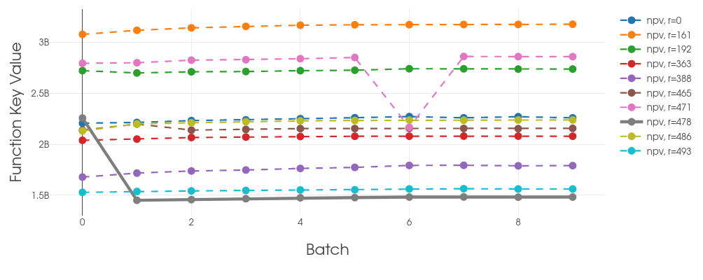

**********************************
Analysis and results visualization
**********************************

Deep diving into the Everest optimization results is important and necessary in order to ensure the understanding of the results. One must consider whether the optimized strategy makes sense (given your current field knowledge) or not. Examine the output files to study details from the optimization process. Use visualization tools such as `ResInsight`_ and `everviz`_ (described in the section below) to plot and examine simulation and optimization results. If necessary, fix errors, refine and improve the setup and consider the use of constraints to make the setup more robust. The visualization is just one step of this iterative process of validating results. What validation is needed, is case (field) dependent.

1. :ref:`Everviz <everviz>` visualization.
2. :ref:`Special considerations <specials>`.
3. :ref:`Export <alternates>` and external visualization options.

.. _everviz:

Visualization using Everviz
###########################

Everviz is a visualization tool that is used to visualize optimization results.
The Everviz tool and is designed to be used in conjunction with Everest. The tool is installed as a plugin to Everest and is used to visualize the results of an optimization experiment.
You can install Everviz by running the following command:

.. code-block:: bash

   $ pip install everviz

In order to visualize optimization results, data is needed from an ongoing experiment or a finished one. The command that start the visualization plug-in should be run *after* an optimization experiment. You can start the visualization by running the following command:

.. code-block:: bash

   $ cd everest/model
   $ everest results <config_file.yml>

The above command will start :code:`everviz` for the case name specified in the loaded configuration file, :code:`config_file`.

.. warning:: If no visualization plugin is installed the message: *No visualization plugin installed!* will be displayed in the console.

After a successful launch, :code:`everviz` will open as a web application in your default Internet browser.

    The home menu. Each item on the home menu is described in details in the following sections.

.. _obj:

Objectives
*************

The first set of plots focuses on the objective function, and its evolution across the batches is plotted as presented in the figure below.

.. note:: Scrolling over the plots with the cursor displays the exact values of the function.

The menu on the left hand side of the plot allows to select which objective functions to display. The drop down list allows to select from all available objective functions, along with the display options. The user is encouraged to go through the various display setting in order to achieve a personalized plot.

The objective of the optimization experiment can also be visualized as a weighted average in the case of a multi objective experiment, or as the average of the individual realizations in the case of a single objective experiment with its evolution across the batches.

    Single objective (NPV) experiment with the objective plotted as the average of different realizations

    Multi objective experiment (NPV and FWPT) where objective function is plotted as a weighted average (50-50) of the two objectives.

The top right corner menu of the plot allows to zoom in/out into the plot, zoom into selection, hover over data points and compare data. On the far right of the menu there are options for screenshot the plot (which will export it as an *jpeg* image), expand to full page view, and download the plot data as a *csv* file.

.. _smr_val:

Summary Values
***************

Summary keys from reservoir simulators can be plotted in two ways, as a function of time (while choosing which batches to plot) and as a function of batch (choosing for which report steps to plot). Both plots allow for display of statistics and filter of realizations. As explained in the section above, all :code:`everviz`  plots can export data and capture snapshot of the plot.

.. important::   As a general rule, the selection of the data to be plotted is available on the left hand side drop-down menu.

   | Keywords from different batches can be plotted together on the same plot, so it is completely up to the user how/what data is being displayed.

In this example, we chose to plot **FOPT** and **WOPT** for producer **OP_5** for batches 0, 2 and 12. Furthermore, all realizations are included in the plot.

The dates available to plot the summary values as a function of batches are the dates defined as report steps in the Everest configuration file.

.. code-block:: yaml

	model:
  		report_steps: ['2000-01-01', '2001-01-01', '2002-01-01', '2003-01-01', '2004-01-01', '2005-01-01', '2006-01-01', '2007-01-01', '2008-01-01', '2009-01-01', '2010-01-01', '2011-01-01', '2012-01-01', '2013-01-01', '2014-01-01', '2015-01-01']

.. _rates:

Well rates
***************

Similar to the previous section, well rates can be visualized as a function of time, across multiple batches. The user can toggle through the production and injection rates using the left hand side drop down menu. Batches are selected in the same manner.

| If the optimization experiment has a prescribed rate, this can be added to the plot.

.. _cross:

Cross plots
***************

This plot will load all the data from Everest export and all columns can be visualized in a crossplot. All available keywords can be chosen from the drop down menus, along with the choice of axis (linear or logarithmic).

.. _ctrl:

Controls
***************

The evolution of the control variables over batches can be visualised through the **Controls** plot tab. Multiple controls can be added to the same plot.

The plot below offers on overview of all initial control variables defined for the experiment against their optimized values.

.. note:: Scrolling over the plots with the cursor displays the exact values of the function.

.. _deltas:

Objectives Delta Values
*************************

The plots of this section display the difference between initial and optimal as bar charts. The first plot focuses on the objective functions and the second one on the summary keys. Similarly to previous plots, multiple keywords/objectives can be plotted together in the same plot. The choice of variables to plot is done through the drop down menus on the left hand side of the plots.

.. note:: Scrolling over the plots with the cursor displays the exact values of the function.

.. _cfg:

Config editor
****************

Everviz configuration is customizable through the editor tab.

.. note:: The Everviz configuation is written in **yaml** syntax, and based on the underlying **Webviz**. For more detailed information and examples regarding the configuration please refer to the detailed Webviz_ documentation.

.. admonition:: To edit the configuration:

	| To start editing the current configuration press the **EDIT** button at the bottom of the page.

	| This will render the entire text editable.

	| Once changes are made, press the **SAVE** button, this will reload the entire Webviz page in order to reflect these changes.

Through this editor the user can change the appearance of the entire Everviz application: title, pages included, content of these pages, removing and adding plots etc.

Shutdown Everviz
-----------------

In order to close the current Everviz application return to the origin terminal and press: **Ctrl + C**.

The message is also being displayed in bold green in the terminal window.

.. _specials:

Special considerations
########################

Sometimes reservoir simulations fail during the optimization process, both when you are using one single and multiple realizations.

.. warning:: If you have multiple realizations, **Everest will compensate for this by assigning an average value for the objective function for this specific realization (averaged over the successful realizations)**.

.. note::

	Since this is the default implemented behavior, Everest will not give any warning about this, so it is advised to study plots in Everviz, similar to the ones below, in order to spot and examine the impact of this, since it might have some consequences for the reported optimised results.

In the example provided in the plots below, **realization #478** fails in **batch_0** and is therefore given an average value of the objective function. Due to this we get a relatively high objective function value (see lower most plot), which is reported as accepted and the best batch in the run. Similar, in **batch_6** **realization #471** fails, and the result this time is a drop in the total averaged objective function. Those batches (#0 and #6) have objective function values that are “artificially” different from the rest due to this handling of failed realizations. However the impact of this will be dependent on how many realizations you have included in your optimization, how many realizations failed, and finally, whether the realizations that fail are likely to be far from the mean objective function or not.

It is strongly advised to keep an eye on this behavior, since in this case a sub-optimal objective function value is reported as the best and it is likely that subsequent batches represent improved strategies, even though they are reported as rejected (in this case all realizations finish successfully in the following batches, and Everest will not report any improvement after **batch_0**).

The plots below illustrate how this issue could can be spotted through visualization of the results. It is important to stress that the impact of failed realizations on the optimization results is strongly case dependent.

|

.. _alternates:

Everest export and external visualization tools
#################################################

Data from any finished experiment can be exported to a **csv** format file by running the **export** command:

Open a unix command window and type the following line

.. code-block:: bash

   $ cd everest/model
   $ everest export <config_file.yml>

The above command will create the export file at :file:`everest/output/case_name/config_file.csv`.

.. important::

	For more detailed information and examples regarding this functionality please refer to the detailed :ref:`documentation <evexport>`.

Once exported, the optimization results can be imported into other visualization tools supporting csv imports.

.. list-table::

   * - .. figure:: images/everviz/spotfire.png
    	    :width: 600px
            :height: 152px
            :align: center
            :alt: spotfire
            :scale: 60
	    :figclass: align-center

     - .. figure:: images/everviz/power_bi.png
    	    :width: 440px
            :height: 180px
            :align: center
            :alt: power bi
            :scale: 80
	    :figclass: align-center

For more curve plotting, but also 3D visualization, reservoir simulation data can be imported into ResInsight_.

.. _ResInsight: https://resinsight.org
.. _Webviz: https://github.com/equinor/webviz-config
